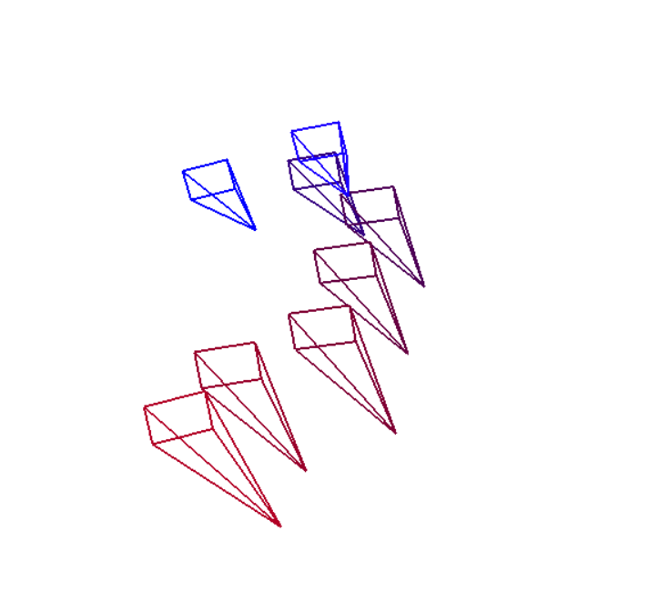
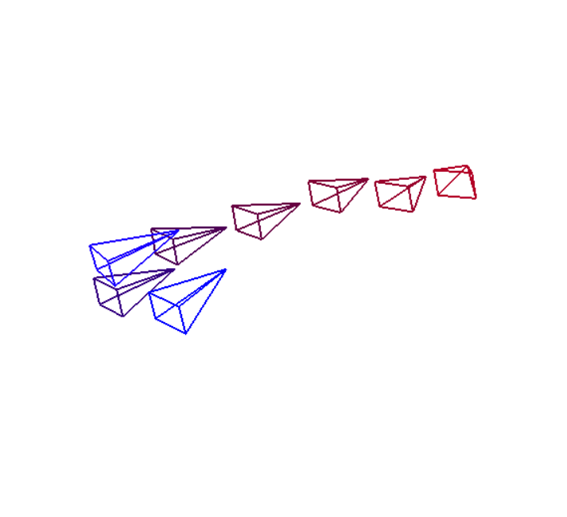

# SLAM-SpaceMapper

## Overview
Using ORB-SLAM, create a monocular camera visual SLAM system on a robot to effectively map a room. Camera feed is processed by Raspberry Pi and transferred to laptop for algorithm processing.

## Status

Currently waiting for parts to come in, CADing robot in OnShape and Leetcode in the meantime :D

Hopefully will be able to take some sample pictures for calibration by next week too!

Robot is being 3D printed soon.

## Method

Before this project and researching SLAM, I wanted to create another "embedded" robot. I researched how I can get a LIDAR or pair of stereo cameras, but ultimately they were a bit too expensive. I settled on a monocular SLAM system since developping firmware/drivers for a MIPI CSI would require a hefty MPU (which I don't have the money for) and the Raspberry Pi only has 1 CSI port. 

This stack uses Scaled FAST and Oriented BRIEF for its frontend and Sliding Window Bundle Adjustment for its backend. Epipolar geometry and triangulation are used in the frontend to determine the visual odometry and 3D-feature points. 

This project would not have been possible without the [slambook](https://github.com/gaoxiang12/slambook2/tree/master), it taught most concepts used in this project. 

## Prequesites

Requires G2O, OpenCV, Sophus, Eigen, OpenGL and Pangolin. Uses C++ 17.

## Running

```shell
git clone <repo>
cd <repo>
mkdir build && cd build
cmake ..
make
./app
```

## Encountered Problem Log

After completing the initial algorithm without loop-closure, the algorithm fairly well for visual odometry. However, after trying a dataset, visual odometry is a lot harder than previously thought. Shiny objects and reflective surfaces can pose a problem for cameras and feature detection. I can see the benefits of LIDAR SLAM and more complex CV techinques when using cameras.

I can try to take more pictures and try again. I want to implement the loop closure and optimize the frontend and backend as much as my hardware will allow.

After a few test_data runs and some Lie Group confusion, I managed to get the visual odometry and visualizer of the map working. I realized that the scale problem is still prevelant and that even if a frame moves by a significant amount, the program/algorithm cannot tell. I found that I am working on a variant of ORB-SLAM and I am encountering the same problems with feature detection and changing lighting. With that, I started reading up on ORB-SLAM2 and ORB-SLAM3 published by ROS and the improvements they made were fairly clever, particularly the use of optimizing the features directly instead of the estimate pose.

Here is my test_data run w/ the data found in /test_data:

<p align="center">
  
</p>

<p align="center">
  
</p>

Blue are the first images and the gradient to red is later in time.